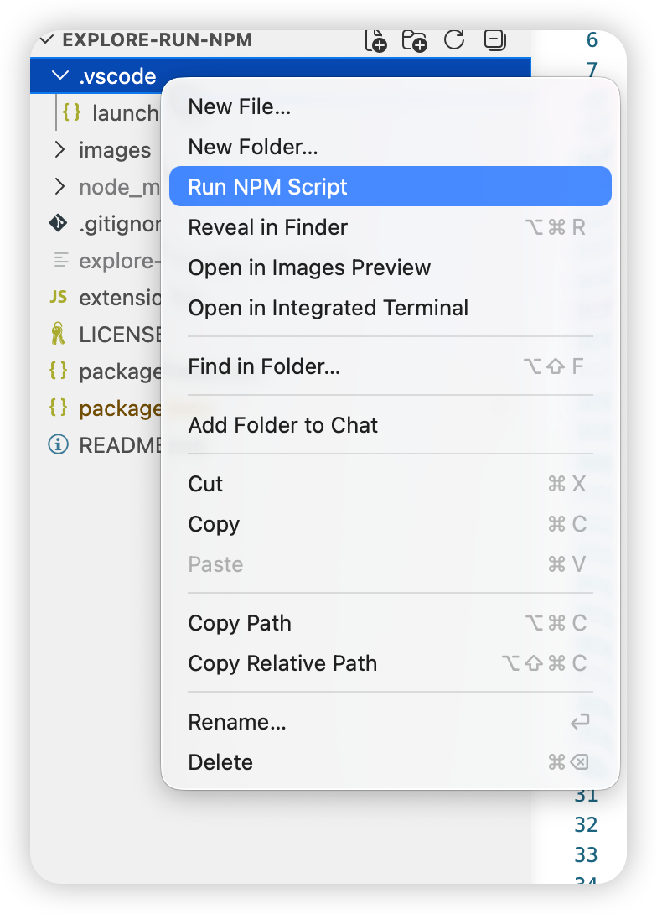

# Explore Run NPM

Run npm scripts directly from the VS Code Explorer context menu.

## Screenshot



## Features

- Right-click a file, folder, or `package.json` in the Explorer and choose **Run NPM Script**.
- Automatically finds the nearest `package.json` for the selected item.
- Shows all available npm scripts in a Quick Pick list.
- Runs the selected script in a VS Code terminal with the correct working directory.
- Detects pnpm, Yarn, and Bun projects and lets you choose the package manager while keeping npm available.
- Supports single-folder and multi-root workspaces.

## Usage

1. Open a project that contains a `package.json`.
2. Right-click a file, folder, or `package.json` in the Explorer.
3. Select **Run NPM Script**.
4. Choose the npm script you want to run.
5. If another package manager is detected, choose whether to run it with pnpm, Yarn, Bun, or npm.

The extension opens a new terminal and runs:

```sh
<package-manager> run <script-name>
```

## Requirements

- VS Code `1.85.0` or newer.
- Node.js and npm available in your environment.

## Extension Settings

This extension does not contribute any settings.

## Known Issues

- Package manager detection is based on `packageManager` in `package.json` and common lockfiles such as `pnpm-lock.yaml`, `yarn.lock`, and `bun.lockb`.

## Release Notes

### 1.0.0

Initial release.

---

## 中文说明

从 VS Code 资源管理器右键菜单直接运行 npm scripts。

## 功能

- 在资源管理器中右键文件、文件夹或 `package.json`，选择 **Run NPM Script**。
- 自动查找与当前选择项最接近的 `package.json`。
- 通过 Quick Pick 列出所有可用的 npm scripts。
- 在正确的工作目录中打开 VS Code 终端并运行所选脚本。
- 检测到 pnpm、Yarn 或 Bun 项目时，可以选择使用对应包管理器运行，同时保留 npm 选项。
- 支持单文件夹工作区和多根工作区。

## 使用方法

1. 打开包含 `package.json` 的项目。
2. 在资源管理器中右键文件、文件夹或 `package.json`。
3. 选择 **Run NPM Script**。
4. 选择要运行的 npm script。
5. 如果检测到其他包管理器，选择使用 pnpm、Yarn、Bun 或 npm 运行。

插件会打开一个新的终端并执行：

```sh
<package-manager> run <script-name>
```

## 环境要求

- VS Code `1.85.0` 或更高版本。
- 当前环境中可用的 Node.js 和 npm。

## 扩展设置

此扩展暂不提供额外设置项。

## 已知问题

- 包管理器检测基于 `package.json` 中的 `packageManager` 字段，以及 `pnpm-lock.yaml`、`yarn.lock`、`bun.lockb` 等常见 lockfile。
